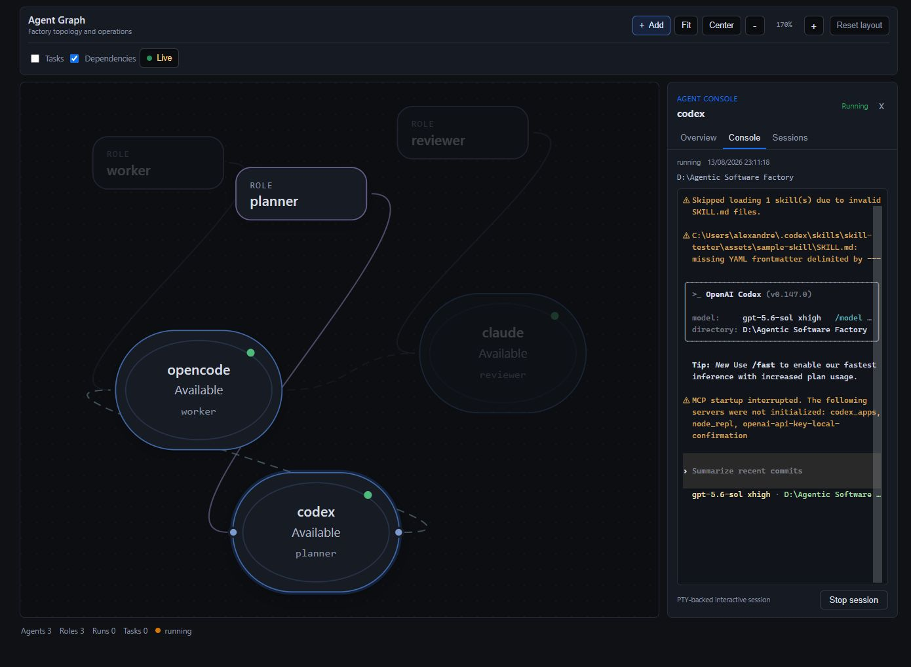

# Agentic Software Factory

Agentic Software Factory is a local tool that orchestrates coding agents from an
interactive Agent Graph. You install and authenticate the agents (Codex, Claude Code,
OpenCode, Gemini CLI, or another CLI). The Factory plans workflows into real task DAGs,
runs tasks in isolated git worktrees, reviews evidence, and records each invocation in
local SQLite state.

The runtime is **role-aware**: a plan's tasks carry a semantic operation
(`advisory`, `implement`, `verify`, `review`, `post_process`), matched to each role's
execution class. Researchers and Architects produce persisted artifacts consumed by
implementation tasks; a Test Engineer verifies; specialized review roles such as the
Security Auditor evaluate the diff and can route `request_changes` back into bounded
implementation rework; a Documentation Writer runs last. Custom roles work without
source changes — for example a `performance_analyst` with `execution_class = "review"`
behaves like any other specialized reviewer.

Simple workflows stay simple: a small fix still plans as Worker → Reviewer.


See [docs/roles.md](docs/roles.md) for execution classes, operations, artifacts,
specialized reviews, and custom roles.

## Install

Ready-made binaries are available for Windows (x86_64), Linux (x86_64), and macOS
(Apple Silicon and Intel). No Rust, Node, or administrator rights are required.

### Windows

```powershell
irm https://raw.githubusercontent.com/OmegaMc1331/agentic-software-factory/main/install.ps1 | iex
```

### Linux / macOS

```bash
curl -fsSL https://raw.githubusercontent.com/OmegaMc1331/agentic-software-factory/main/install.sh | sh
```

Then check the install:

```bash
factory --version
factory init
factory start
```

If `factory` is not found, open a new terminal. Windows adds the install location to
your user PATH; macOS and Linux print the line to add to your shell profile. Running the
installer again replaces an older version with the latest release.

### Uninstall

Remove the binary and any PATH entry you added:

- Windows: delete `%LOCALAPPDATA%\Programs\AgenticSoftwareFactory`, then remove its
  `bin` directory from your user PATH under **System Properties → Environment Variables**.
- macOS / Linux: `rm ~/.local/bin/factory`.

Your project-local `.factory/` state is not removed.

## Quick start

```bash
cd my-project
factory init
factory start
```

`factory init` creates `.factory/` with a default configuration. `factory start` serves
the local API and dashboard, waits until the server is ready, then opens
`http://127.0.0.1:4321`.

In Agent Graph, configure the Planner, Worker, and Reviewer agents. Create a Workflow,
review its task plan, then select **Start**. The Rust Factory process owns execution, so
closing the browser doesn't stop active work.

## Configure agents

Use Agent Graph or **Settings → Agents** to add installed coding agents and assign
roles. Configuration lives in `.factory/config.toml`; the dashboard writes it for you,
and you can edit it directly:

```toml
[agents.codex]
kind = "codex"
command = "codex"
args = ["exec"]

[[role_assignments]]
role = "planner"
agent = "codex"
preferred = true

[[role_assignments]]
role = "worker"
agent = "opencode"
```

Known coding agents are configured with their standard non-interactive workflow
invocation. Custom CLIs can choose whether Factory passes the mission through stdin or
as one process argument; `{mission}` can set that argument's exact position.

The Factory never talks to model providers. If a required role is missing or its
executable or workflow invocation is unavailable, the operation fails instead of
selecting a fallback agent.

## Roles

Roles describe responsibilities; agents are the CLIs that perform them. Eight core
roles are built in (Planner, Worker, Reviewer, Architect, Researcher, Test Engineer,
Security Auditor, Documentation Writer), a role can be filled by several agents at
once, and one agent can hold several roles — no `worker2`-style duplicates. You can
create custom roles with their own instructions from Agent Graph, and each workflow
selects the team of roles and agents that may participate. See
[docs/roles.md](docs/roles.md) for the full guide.

## Policies

Role instructions say what an agent should do; a **policy** says what Factory
permits it to do. Project-local policies in `.factory/config.toml` control
filesystem read/write scopes, command allow/deny lists, Git operations,
network (advisory), and which environment variables reach the agent process.
Policies apply per role and per agent, deny rules win, and Factory's own safety
invariants (protected `.factory` state, no push/force-push from task agents,
Integration Engine authority) always apply. Tasks that cannot legally execute are
blocked before anything runs, without consuming retries. See
[docs/policies.md](docs/policies.md).

```toml
[policies.roles.worker.filesystem]
read = ["**"]
write = ["src/**", "tests/**"]
deny_write = [".github/**"]
```

## GitHub: Issue → Workflow → Pull Request

With the locally authenticated [`gh`](https://cli.github.com) CLI, Factory closes
the loop from issue to pull request. In Agent Graph, **+ Workflow → From GitHub
Issue** imports `#42` or an issue URL as a normal workflow: the Planner produces
an editable DAG, execution is unchanged, and issue content is treated as
untrusted context that can never alter permissions. After a workflow completes,
the Workflow Inspector offers **Create Pull Request** — an editable preview,
then a safe push of the Factory-owned `factory/run-<id>` branch and a
deterministic, evidence-based PR body. Existing PRs are linked, never
duplicated; agents never gain push permission. See
[docs/github.md](docs/github.md).

## Dashboard

Agent Graph is the primary operating interface:

- Create a Workflow from an objective, then inspect its real tasks and dependencies.
- Start, cancel, and retry supported workflow operations.
- Drag nodes; add agents, roles, groups, and notes; edit supported links; and use
  fit, center, zoom, or reset controls. Layout persists in `.factory/graph.json`.
- Select an agent to inspect real workflow sessions or explicitly start its interactive
  console.

The Performance view measures how each agent actually performs from local workflow
history — first-pass approval, retries, durations, and integration quality, with role,
operation, and language breakdowns and honest sample sizes ([docs/evaluations.md](docs/evaluations.md)).

Routing stays deterministic and local. The default round-robin behavior is unchanged;
opting into `[routing] mode = "performance"` ranks eligible agents by a documented
confidence-aware score over that measured history (capacity- and policy-aware, with a
round-robin fallback when data is thin), and every dispatch records an explainable
routing decision. Tasks can also be pinned to a specific agent from the Task Inspector
([docs/routing.md](docs/routing.md)).

The Runs and Settings views remain available for focused inspection and configuration.



The local API is bound to `127.0.0.1`:

| Method | Route                         | Description                                      |
| ------ | ----------------------------- | ------------------------------------------------ |
| GET    | `/api/health`                 | Service health                                   |
| GET    | `/api/runs`                   | Workflow summaries and task counts               |
| POST   | `/api/runs`                   | Create and asynchronously plan a workflow        |
| POST   | `/api/runs/from-issue`        | Import a GitHub Issue as a workflow               |
| GET    | `/api/runs/:id`               | Workflow, tasks, attempts, and sessions           |
| POST   | `/api/runs/:id/start`         | Validate and start a planned workflow             |
| POST   | `/api/runs/:id/cancel`        | Cancel a live workflow operation                  |
| PUT    | `/api/runs/:id/team`          | Replace the workflow team before it starts        |
| GET    | `/api/runs/:id/delivery`      | GitHub link, delivery state, and eligibility      |
| GET    | `/api/runs/:id/pr-preview`    | Editable pull request preview and blockers        |
| POST   | `/api/runs/:id/pull-request`  | Deliver: push the run branch and create the PR    |
| GET    | `/api/github/status`          | gh auth status and the resolved GitHub remote     |
| POST   | `/api/tasks/:id/retry`        | Retry an eligible failed task                     |
| GET    | `/api/roles`                  | Role definitions and assignments                  |
| POST   | `/api/roles`                  | Create a custom role                              |
| PUT    | `/api/roles/:id`              | Update a custom role definition                   |
| DELETE | `/api/roles/:id`              | Delete an unused custom role                      |
| PUT    | `/api/roles/:id/policy`       | Set or clear a role's policy preset               |
| POST   | `/api/roles/:id/assignments`  | Assign an agent to a role                         |
| GET    | `/api/graph`                  | Agents, workflows, tasks, and semantic links     |
| GET    | `/api/performance/agents`     | Measured agent performance summaries             |
| GET    | `/api/performance/agents/:agent` | Full performance detail for one agent         |
| GET    | `/api/graph/workspace`        | Saved visual layout and custom topology          |
| PUT    | `/api/graph/workspace`        | Validate and atomically save the graph workspace |
| GET    | `/api/agents/:agent/sessions` | Recent persisted sessions for one agent          |
| POST   | `/api/agents/:agent/sessions` | Start an interactive session for that agent       |
| GET    | `/api/sessions/:id/stream`    | SSE updates for one known session                |
| GET    | `/api/sessions/:id/terminal`  | WebSocket for one live interactive session       |
| GET    | `/api/config`                 | The agent and role configuration                 |
| PUT    | `/api/config`                 | Write a validated configuration atomically       |

## How it works

```text
Agent Graph → local API → Factory Core → Planner → task DAG
                                      → Worker → worktree → evidence
                                      → Reviewer → approve or retry
```

**Plan** asks the selected Planner for structured tasks and dependencies without
changing the repository; tasks may target specific roles from the workflow's team.
**Start** validates the team, Git repository, DAG, and each task's effective policy,
then runs ready tasks in isolated worktrees. A task completes only after structured
Reviewer approval; process exit alone is not completion. Worker failures and change
requests retry up to three total attempts; policy blocks never consume retries.
Every invocation is an `AgentSession` that records the role and agent that ran, plus
which policy applied.

All state lives in `.factory/`:

```text
.factory/
  db.sqlite3          runs, tasks, attempts, and agent sessions
  config.toml         agents, role assignments, and policies
  graph.json          saved positions, visual nodes, and custom links
  worktrees/t<id>/    one git worktree per task
```

Not implemented: OS-level sandboxing (policies are orchestration controls, not
virtualization) or remote/cloud execution.

## Development

See [docs/development.md](docs/development.md) for source builds, tests, and embedded
dashboard release builds.

## License

MIT. See [LICENSE](LICENSE).
