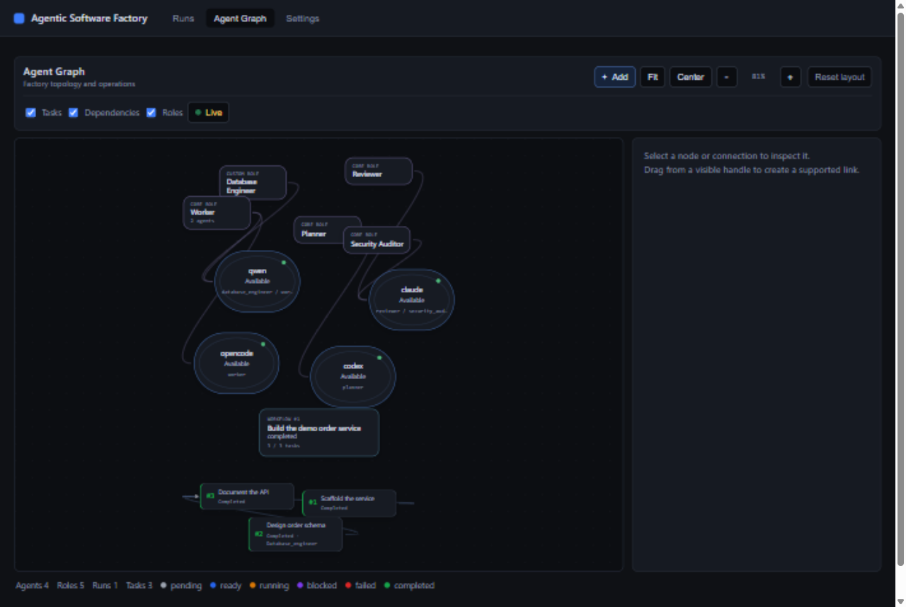
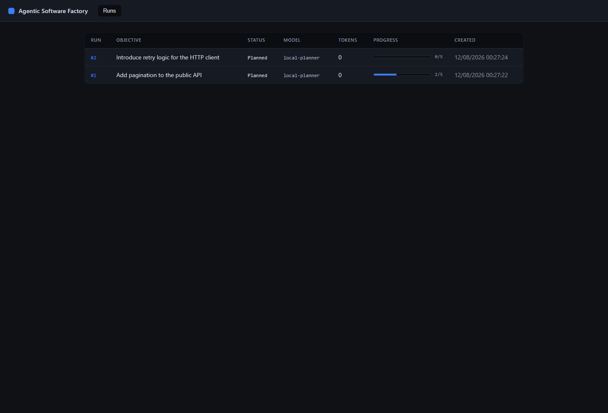
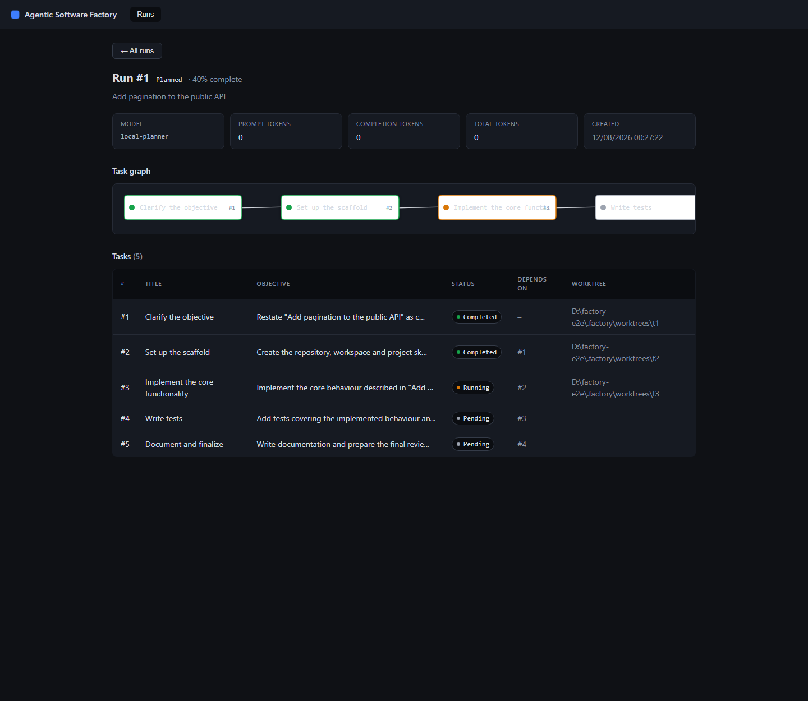
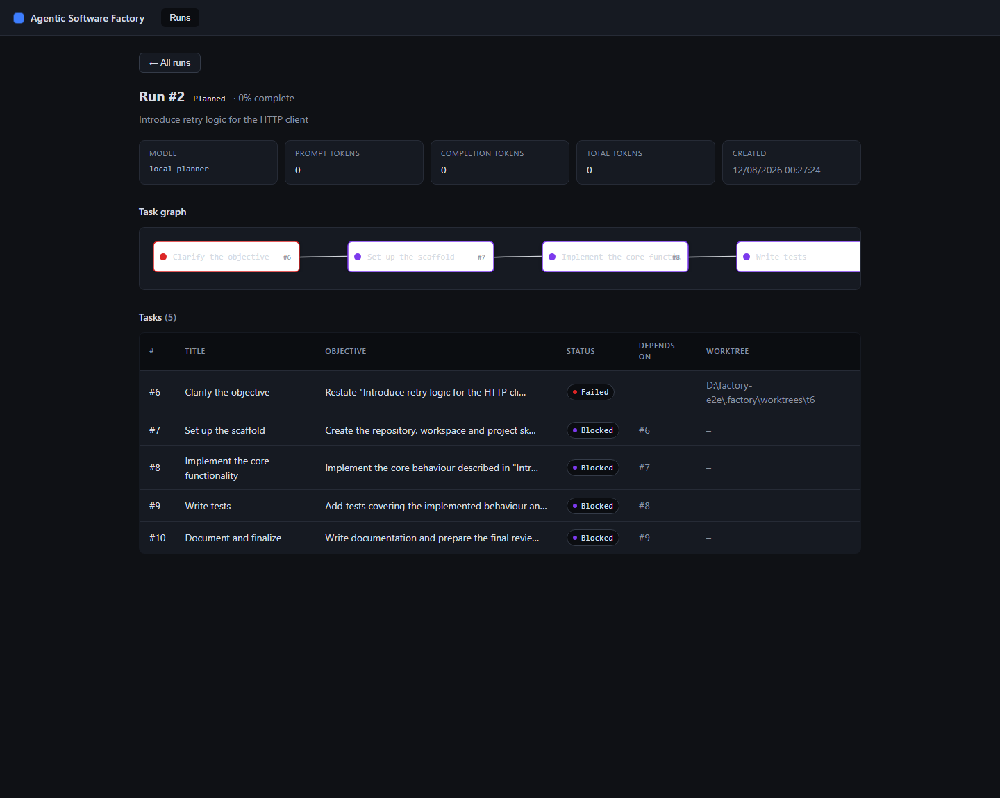

# Agentic Software Factory

Agentic Software Factory is a local tool that orchestrates coding agents through
structured tasks and isolated git worktrees. You install and authenticate the agents
(Codex, Claude Code, OpenCode, Gemini CLI, or any custom CLI); the factory plans a run
into tasks with dependencies and acceptance criteria, gives each task its own git
worktree, and records every step in a local SQLite database.



## What it does

- Plans a software objective into ordered tasks with acceptance criteria and
  dependencies using a configured planner agent.
- Gives each task an isolated git worktree on its own branch.
- Tracks every task through a strict state machine (`pending -> ready -> running ->
  completed`, or `failed`/`blocked`).
- Derives the run status from its tasks (planned, active, completed, failed).
- Records every agent invocation (command, exit code, output) in SQLite.
- Serves a local dashboard for runs, the agent network, and configuration.

The factory does **not** manage model providers. It has no API keys and never calls a
model API. Agents are external coding CLIs that you install and authenticate yourself;
the factory only runs their commands.

## How it works

```text
CLI / Dashboard
      │
      ▼
Factory core ── planner runs a coding agent as a subprocess
      │
      ├── SQLite (runs, tasks, sessions)
      └── git worktrees (.factory/worktrees/t<task-id>)
```

A run is created with `factory run "<objective>"`. The factory resolves the planner
role from `.factory/config.toml`, asks that agent for a JSON plan, validates it, and
persists the run and its tasks. Each first task starts `ready`; tasks with dependencies
start `pending`. You move tasks through the state machine from the dashboard's
development commands (`factory dev mark`), and each task's work is done in its own
worktree so parallel agents never collide.

All state lives in `.factory/`:

```text
.factory/
  db.sqlite3          SQLite database (runs, tasks, agent sessions)
  config.toml         agents and role assignment
  worktrees/t<id>/    one git worktree per task
```

## Install

Requirements: Rust (stable). Node.js is only needed once, to build the dashboard.

```bash
git clone https://github.com/OmegaMc1331/agentic-software-factory
cd agentic-software-factory
cd apps/dashboard && npm install && npm run build && cd ../..
cargo build --release
```

The dashboard build is served by `factory start`; it does not need a separate dev
server in normal use. Frontend contributors can keep using `npm run dev` (see
[Development](docs/development.md)).

## Quick start

```bash
factory init
factory start
```

`factory init` creates `.factory/` with a default configuration. It works on a machine
with no coding agent installed. `factory start` runs one process that serves the API
and the dashboard and opens your browser:

```text
Agentic Software Factory running at http://127.0.0.1:4321
```

Then, in the dashboard:

1. Go to **Settings** and configure the coding agents you have installed (name,
   command, arguments).
2. Assign agents to the **planner**, **worker**, and **reviewer** roles. The config is
   written to `.factory/config.toml`.
3. In a terminal run `factory run "your objective"` to create a planned run, then
   inspect and advance it.

## Configure agents

Agent and role configuration lives in `.factory/config.toml`, created by `factory
init`. The dashboard's **Settings** tab edits this file for you; you can also edit it
by hand.

```toml
[agents.codex]
command = "codex"
args = ["exec"]

[roles.planner]
agent = "codex"
```

A role points to an agent by name; the same agent may fill several roles. The factory
never talks to model providers. If a role has no agent assigned, or the agent's
executable is not on `PATH`, the factory fails with a clear message instead of using a
fallback:

```text
No agent is assigned to the planner role. Configure one from the dashboard.
Planner agent `codex` is not available. Check the agent configuration.
```

## Dashboard

`factory start` serves the dashboard at `http://127.0.0.1:4321`:

- **Runs** — every run with its status and progress; opening a run shows its task
  graph and full task list.
- **Agent Graph** — the whole factory as a network of agents, roles, and runs on a
  pannable, zoomable canvas.
- **Settings** — add, edit, and remove agents, test executable availability, and
  assign the planner/worker/reviewer roles.





The local API is bound to `127.0.0.1`:

| Method | Route            | Description                                  |
| ------ | ---------------- | -------------------------------------------- |
| GET    | `/api/health`    | Service health                               |
| GET    | `/api/runs`      | Runs with per-state task counts              |
| GET    | `/api/runs/:id`  | One run and its tasks                        |
| GET    | `/api/graph`     | Agents, roles, runs, and tasks as a network  |
| GET    | `/api/agents`    | Configured agents with executable status     |
| GET    | `/api/config`    | The agent/role configuration                 |
| PUT    | `/api/config`    | Write a validated configuration (atomic)     |

## Current status

Working today: run creation through a configured planner, task state machine with
cascade propagation, run-status reconciliation, git worktrees per task, agent session
recording, versioned SQLite migrations, and a dashboard with runs, an agent network,
and agent/role configuration.

Not yet implemented: an autonomous worker loop, review execution, parallel agents,
automatic merging, and anything involving remote/cloud execution.

## Development

See [Development](docs/development.md) for the full contributor workflow.

```bash
cargo test --workspace
cargo clippy --workspace --all-targets -- -D warnings
cargo fmt --all -- --check

cd apps/dashboard
npm run format:check
npm run lint
npm run typecheck
npm test
npm run build
```

## License

MIT. See [LICENSE](LICENSE).