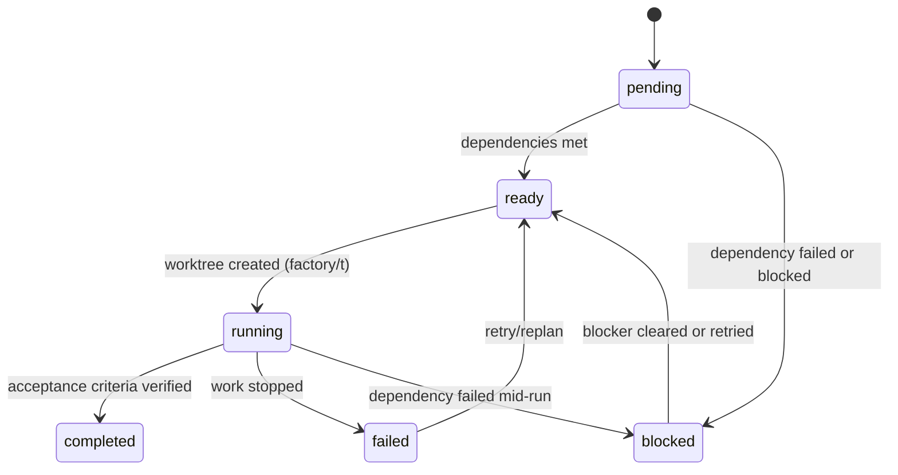
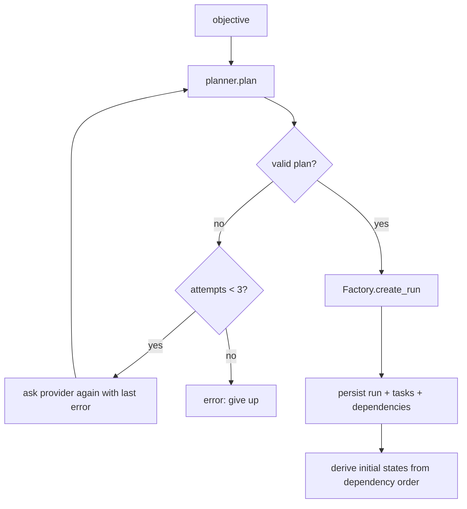
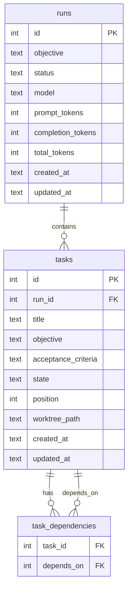

# Architecture

Agentic Software Factory is a workspace of six Rust crates plus a React dashboard.
Nothing is networked except the local dashboard API. All durable state is a SQLite
database; all agent isolation is handled by git worktrees.

## Crate structure

```text
crates/
  factory-models   Pure data types: Run, Task, Plan, PlannedTask, ModelUsage, TaskState
  factory-db       SQLite persistence behind a thin FactoryDb layer
  factory-git      Repository detection and worktree management (git plumbing/porcelain)
  factory-core     Providers, planning, validation, and the Factory orchestrator
  factory-api      Local HTTP API (axum) read endpoints for the dashboard
  factory-cli      The `factory` binary: init, run, status, tasks, inspect, mark, worktree, serve
apps/
  dashboard        Vite + React + TypeScript dashboard for runs and tasks
```

Dependency direction: `factory-cli -> factory-api -> factory-core -> factory-db`,
`factory-core -> factory-models`, `factory-core -> factory-git`.

### factory-models

Plain structs with no behavior beyond serialization and parsing:

- `TaskState` - the six-state enum with `as_str()` and `FromStr`.
- `Run` / `Task` - persisted shapes (ids, timestamps, token counts).
- `Plan` / `PlannedTask` - the strict planner contract (`acceptance_criteria` is a list
  of strings, `dependencies` and `exit_criteria` default to empty).
- `ModelUsage` - prompt/completion/total token counts.

### factory-db

A single connection, one schema migration run at open. Tables:

- `runs` (`id` PK, `objective`, `status`, `model`, `prompt_tokens`,
  `completion_tokens`, `total_tokens`, `created_at`, `updated_at`)
- `tasks` (`id` PK, `run_id` FK, `title`, `objective`, `acceptance_criteria` JSON text,
  `state`, `position`, `worktree_path`, `created_at`, `updated_at`)
- `task_dependencies` (`task_id` FK, `depends_on` FK, PK on both)

Transactional writes for runs (root task) and updates; a `TaskCounts` helper computes
per-state counts for the API and CLI.

### factory-git

`Repo` wraps commands against a repository tree. Design notes:

- Repository discovery walks up from the factory root and honor a ceiling directory to
  avoid escaping the project (paths are canonicalized so Windows 8.3 short names do not
  defeat the bounded check).
- `is_main_worktree` handles repositories whose `.git` is a relative file (worktrees).
- Worktrees are added with `git worktree add` onto branch `factory/t<task-id>`, listed
  from `git worktree list --porcelain`, and removed with `prune` before removal.
- Removal refuses worktrees with uncommitted changes.

### factory-core

The heart of the system.

`Provider` trait - `fn plan(&self, objective) -> Result<Plan, ...>`.

- `OpenAICompatibleProvider` - HTTP POST to `{base}/chat/completions` with the model
  name; parses `choices[0].message.content`.
- `LocalProvider` - deterministic five-task pipeline used offline and in tests.

`Planner` - validation and retry loop:

1. Ask the provider for a plan, stripped of code fences.
2. Validate: non-empty tasks, known dependency ids, acyclic graph, at most 50 tasks.
3. Re-request up to three times on invalid output; fail with the last validation error.

`workflow` - the state transition table and cascade propagation:

- Transitions are validated against a fixed table: `pending -> ready|blocked`,
  `ready -> running`, `running -> completed|failed|blocked`, `blocked -> ready`,
  `failed -> ready`; `completed` is terminal.
- In normal flow `blocked` is derived state, though the table also permits marking it
  directly; it is never accepted from `ready` or `completed`.
- A `completed`/`failed`/`blocked` target triggers cascade propagation (BFS) through
  every transitive dependent: a dependent becomes `blocked` if any dependency is
  `failed`/`blocked`, `ready` if all dependencies are `completed`, and `pending`
  otherwise. Tasks already `completed` or `failed` are skipped.
- `factory-core` returns the full set of changed task ids from `mark_task`, so callers
  (CLI, tests) can confirm exactly what a transition changed.

`Factory` - the orchestrator tying it together: `init`, `open`, `create_run` (plan ->
persist -> derive initial states), `mark_task` (validate -> persist -> propagate,
returning the full set of changed ids), and worktree operations that mirror
`factory-git` plus task-state checks (a worktree may only be created for a `ready` or
`running` task, and removals must leave no uncommitted changes).

### factory-api

Axum application with three read endpoints proxied by the dashboard dev server. The
run detail returns the run, every task with its dependency ids, and token usage.

### factory-cli

Subcommand dispatch on top of `factory-core` and `factory-api`. Every command resolves
the factory root from the current directory and requires `.factory/db.sqlite3` to
exist except `init`. `serve` runs the tokio multi-thread runtime over the axum app.

## Task state machine



`blocked` is a real state in the transition table (`pending -> blocked`,
`running -> blocked`), so it may be marked directly, but in normal operation it is
always derived by the cascade. When a blocker clears, the cascade recomputes every
affected task from its own dependencies, so a task returns directly to `ready` or stays
`pending` until its remaining dependencies complete. Tasks already `completed` or
`failed` are never re-evaluated by a cascade.

## Plan validation flow



## Data model



## Isolation and state ownership

- The factory never writes outside its root. State is `.factory/`, worktrees are
  `.factory/worktrees/t<task-id>` on branch `factory/t<task-id>`.
- The main working tree is a thin coordination surface: CI applies to it, but agent
  work happens in worktrees.
- Concurrent agents targeting distinct tasks cannot collide because each task owns its
  own branch and worktree.

## Testing strategy

- `factory-db` - round-trip persistence and dependency rows.
- `factory-git` - detection, worktree create/list/remove, dirty-tree refusal.
- `factory-core` unit tests - transition table, cascade propagation both directions,
  reset escape hatch.
- `plan_validation` integration tests - malformed JSON, unknown ids, cycles, oversized
  plans against the local provider.
- `e2e` integration tests - full lifecycle against a scratch repository: plan a run,
  create worktrees, run tasks to completion, verify persistence and propagation.
- Dashboard - vitest for graph layout (levels, diamonds, empty graphs) and utilities.