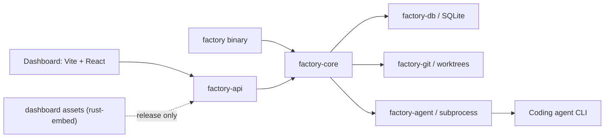
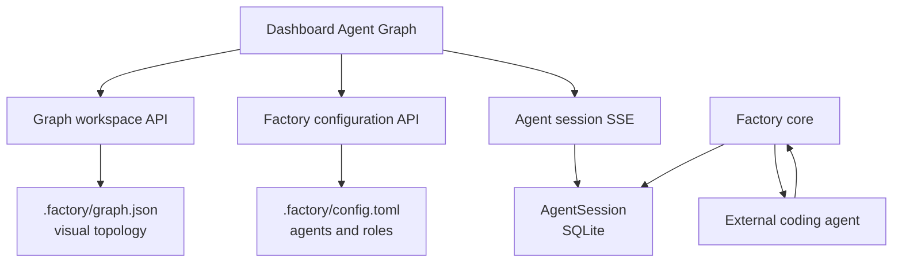
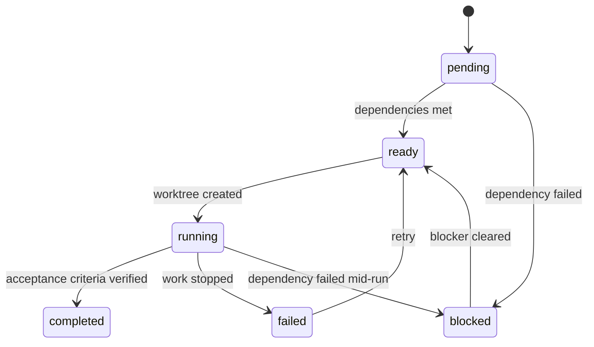

# Architecture

Agentic Software Factory is a workspace of seven Rust crates plus a React dashboard.
The only network service is a local HTTP API bound to `127.0.0.1`. Durable state lives
under `.factory/`: execution records use SQLite, configuration uses TOML, and the graph
workspace uses JSON. Agent isolation is git-based: each task works in its own worktree.



## Crate structure

```text
crates/
  factory-types   Pure data types: Run, Task, Plan, TaskState, AgentSession
  factory-agent   Subprocess execution of external agent CLIs (CommandAgent)
  factory-db      SQLite persistence with versioned migrations
  factory-git     Repository detection and worktree management
  factory-core    Agent config, planning, validation, run orchestration
  factory-api     Local HTTP API (axum): graph, session, and configuration endpoints
  factory-cli     The `factory` binary: init, start, run, status, dev
apps/
  dashboard       Vite + React + TypeScript dashboard
```

Dependencies flow downward: `factory-cli` and `factory-api` use `factory-core`,
which uses `factory-db`, `factory-git`, `factory-agent`, and `factory-types`.

### factory-types

Plain structs with serialization and parsing only: `TaskState` (six-state enum),
`Run`/`Task`, `Plan`/`PlannedTask` (the planner contract: title, objective,
`acceptanceCriteria`, `dependencies`), and `AgentSession`. `RunStatus::from_tasks`
derives a run's status from its tasks:

- all tasks completed → `completed`
- any task failed → `failed`
- any task running, completed, or blocked → `active`
- otherwise → `planned`

### factory-db

One SQLite connection per process. Opening a database runs ordered, versioned
migrations recorded in a `schema_migrations` table; each migration runs once, inside a
transaction, so a failing migration leaves the schema untouched. Migration 1 is the
initial schema (idempotent, so databases created before migrations were introduced keep
working); later migrations change the schema forward.

Every task-state write reconciles the parent run's status from its tasks, so the
database owns run status. Tables: `runs`, `tasks`, `task_dependencies`,
`agent_sessions`.

### factory-git

`Repo` wraps `git` for the operations the factory needs: repository discovery (bounded
by a ceiling so a factory inside a nested path cannot escape into an unrelated parent
repository), worktree creation, listing, and removal, and dirty-tree detection. Worktree
creation attaches an existing branch instead of failing when the task branch already
exists, so retrying a task works deliberately.

### factory-core

`config` — `.factory/config.toml` declares `[agents.<name>]` sections (command, args,
env) and `[roles.<role>]` sections mapping a role to an agent. Resolving a role to a
`CommandAgent` reports clear errors for a missing role, an unknown agent, or a missing
executable. `Config::validate` rejects bad names, empty commands, unknown role
references, and control characters; `Config::write_atomic` writes the file through a
temp file and rename.

`Planner` — one shot at asking the configured planner agent for a JSON plan (objective
on stdin, code fences stripped), validated for known dependency ids, an acyclic graph,
and at most 50 tasks. There is no fallback planner: if no agent is configured for the
role, or the agent fails, planning fails with the resolution error. Every planner
invocation is recorded in `agent_sessions` with its exit code and captured output.

`workflow` — the task transition table and cascade propagation. A task moves
`pending -> ready|blocked -> running -> completed|failed|blocked`; `blocked` derives
from failed dependencies, `failed` can be retried to `ready`, and `completed` is
terminal. Marking a task recomputes every transitive dependent.

`Factory` — ties it together: `init` (creates the state directory, default config, and
database; never touches agent executables), `open`, `create_run` (resolve planner →
plan → persist → derive initial states), `mark_task` (validate → persist → propagate →
reconcile run status), and worktree operations.

### factory-api

An axum application serving the dashboard and the API from one process. Routes:

| Method | Route                         | Purpose                                     |
| ------ | ----------------------------- | ------------------------------------------- |
| GET    | `/api/health`                 | Health                                      |
| GET    | `/api/runs`                   | Run summaries with task counts              |
| GET    | `/api/runs/:id`               | One run and its tasks                       |
| GET    | `/api/graph`                  | Factory entities and semantic connections   |
| GET    | `/api/graph/workspace`        | Saved visual layout and topology metadata   |
| PUT    | `/api/graph/workspace`        | Validate and atomically save graph metadata |
| GET    | `/api/agents`                 | Agents with executable availability         |
| GET    | `/api/agents/:agent/sessions` | Recent sessions for a configured agent      |
| GET    | `/api/sessions/:id`           | One known Factory agent session             |
| GET    | `/api/sessions/:id/stream`    | SSE snapshots for one known session         |
| GET    | `/api/config`                 | Agent/role configuration                    |
| PUT    | `/api/config`                 | Write validated configuration atomically    |

The dashboard is served for every non-API path; unknown `/api/*` paths return 404. How
the dashboard assets are provided depends on the build:

- **Release builds** (`--features embedded-dashboard`): the compiled dashboard is
  embedded into the binary with `rust-embed`. The binary alone is a complete
  installation; there is no dependency on a `dist` directory beside it. The feature
  fails at compile time if `apps/dashboard/dist` is missing.
- **Development builds** (no feature): the server looks for `apps/dashboard/dist`
  relative to the working directory or the binary, and shows a stub page explaining how
  to build the dashboard when it is missing.

The server binds `127.0.0.1`.

## Agent Graph workspace

The dashboard merges two data sources without changing their ownership:

- Factory state from `/api/graph`: agents, roles, runs, tasks, role assignments,
  containment, and task dependencies.
- Visual workspace state from `.factory/graph.json`: manual positions, groups, notes,
  memberships, and custom agent-to-agent links.

`graph.json` is versioned and written atomically. Manual positions override the
automatic neural layout until Reset layout removes them. Groups, notes, memberships,
and custom links organize the workspace only; they do not schedule work. Role
assignments update `.factory/config.toml`. Run containment and task dependencies remain
read-only because they represent persisted execution state.



The Agent Console reads only known `AgentSession` records. The SSE route polls the
selected session and closes after a terminal state. Current planner invocations are
non-interactive, so the UI reports that stdin is unavailable; the route shape remains
compatible with future live worker sessions.

### factory-cli

The `factory` binary. Public commands are `init`, `start` (one process for API and
dashboard), `run`, and `status`. Everything else — `agents`, `config list`, `tasks`,
`inspect`, `mark`, `worktree`, and `serve` — sits under `factory dev` for debugging and
development.

`init` is idempotent: running it inside an already initialized project prints "Factory
already initialized." and does not touch existing state. `start` binds the listener
first, prints the URL, and only then opens the browser (`--no-browser` skips the
browser), so the browser never races an unready server.

## Task state machine



## Isolation and state ownership

- The factory writes only under its root. State is `.factory/`; worktrees are
  `.factory/worktrees/t<task-id>` on branch `factory/t<task-id>`.
- Each task owns its branch and worktree, so concurrent agents cannot collide.
- Run status is derived from tasks; the dashboard never guesses it.
- Agent configuration is a real file shipped through the config API; there is no second
  configuration store.
- Graph workspace metadata is separate from configuration and execution state. Custom
  links never trigger agent execution.

Worktrees are isolation for git branches and concurrent work, not a security boundary.
See [Security](security.md).
