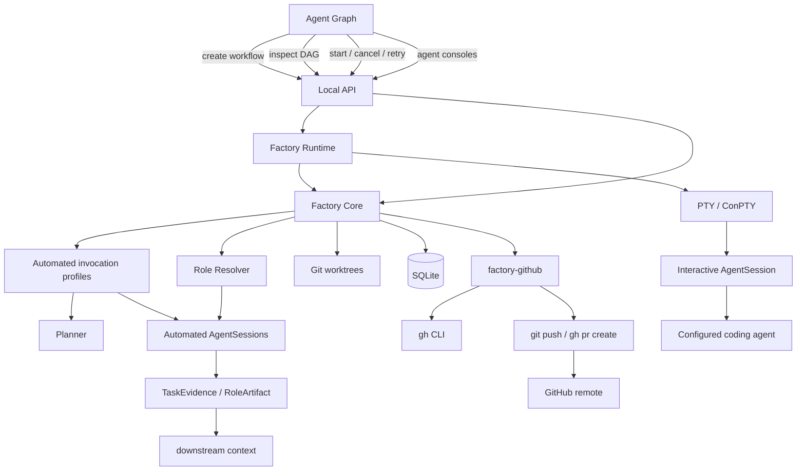

# Architecture

Agentic Software Factory is a local Rust application with a React dashboard. The API
binds to `127.0.0.1`. Durable execution state lives in SQLite, agent configuration in
TOML, and visual graph state in JSON. Each task runs in a Git worktree.



The dashboard requests semantic Factory operations. It does not execute arbitrary
shell commands.

## Workspace structure

```text
crates/
  factory-types     Run, Task, TaskOperation, RoleArtifact, TaskAttempt, evidence,
                    review, session, and GitHub linkage/delivery types
  factory-agent     Configured subprocess execution, output capture, cancellation
  factory-policy    Policy model, precedence resolver, path/environment enforcement
  factory-db        SQLite persistence and versioned migrations
  factory-git       Repository checks, worktrees, and Git evidence
  factory-core      Planning, invariants, mission building, task transitions, and
                    execution policy
  factory-github    gh CLI adapter, remote parsing, bounded Issue import, and the
                    Factory-owned delivery engine (push + pull request)
  factory-runtime   In-process background workflow ownership
  factory-api       Explicit local HTTP operations and session streams
  factory-cli       Bootstrap/runtime CLI: init, start, status, dev
apps/
  dashboard         React, TypeScript, and @xyflow/react
```

Dependencies point toward `factory-types`. The CLI and API use Factory Core; the API
also owns one `factory-runtime` instance for background operations.

## Workflow lifecycle

A new workflow is persisted as `planning` before the Planner starts. Planning is a real
`AgentSession`; successful structured output is validated and persisted atomically as
tasks and dependencies. The workflow then becomes `planned`, and repository work does
not begin until **Start** is selected.

```text
planning → planned → active → completed
                    │       ├→ failed
                    │       └→ blocked
                    └────────→ cancelled
```

A `blocked` run keeps its tasks untouched and can be started again once the blocking
problem (typically a policy or dependency issue) is fixed; starting re-validates
everything from scratch.

Start validates the workflow team (planner, workers, reviewers, and any additional
roles), the Git repository, the task DAG, the presence of planned tasks, and every
task's effective policy — a task that cannot legally execute blocks the run before
any agent process starts, without consuming retries. The first runtime is sequential:

```text
lowest-position ready task
  → resolve its role, operation, and agent
  → create or reuse its worktree
  → AgentSession (role = actual role id, operation)
  → capture Git and agent-reported evidence
  → dispatch by operation:
      advisory    → persist role artifact → task completed
      review      → evaluate diff + evidence → approve, or request_changes → rework
      implement / verify / post_process → produce evidence → built-in Reviewer
                                            → approve, or retry
  → select the next ready task
```

Teams come only from `.factory/config.toml` role assignments. Every workflow stores a
team snapshot: which planner, workers, reviewers, and additional roles participate.
Global assignments answer which agents *may* act as Worker; the team decides which
ones *do* for that workflow. Tasks may name a role (assigned by the Planner from the
team's role catalog) and an operation; a task without a role defaults to Worker and
an operation-less task derives one from the role's execution class. See
[Roles](roles.md) for the full model.

The built-in Reviewer receives
the task objective, acceptance criteria, diff evidence, Worker output, and relevant
upstream artifacts. Its JSON decision must be `approve` or `request_changes`. Change
requests, verification failures, and Worker failures are limited to the bounded
`TaskAttempt` count per task. Specialized review tasks (`operation: review`) return a
structured `{decision, findings[{severity, summary, evidence}]}` result; a
`request_changes` decision routes back to the implementation task the review
evaluated (bounded rework) instead of failing the workflow. Within a team of several
workers, execution attempts route round-robin; review attempts rotate across the
selected reviewers. Selection is a deterministic function of persisted state and
survives restarts.

Cancellation sets a run-scoped signal, stops scheduling, terminates the current
configured agent process tree, and preserves the worktree and recorded evidence. A
Factory restart marks formerly running sessions and attempts as `interrupted`, running
tasks as `failed`, and active/planning workflows as `failed`; the graph can then expose
the failure and eligible retry.

### GitHub linkage and delivery

`factory-github` closes the loop from GitHub Issue to pull request without adding a
second execution engine. An imported Issue becomes the run's objective and a persisted
untrusted link (`github_links`); planning and execution are the normal pipeline, with
every mission carrying an explicit untrusted-context notice. After a run completes,
the delivery engine (`github_deliveries`) is the only code in Factory that constructs
a `git push`: it pushes exactly `factory/run-<id>` — never force, never user branches —
after verifying completion, integration-head equality (branch drift blocks
publishing), and base-branch availability, then creates (or links an existing) pull
request through `gh`. Delivery state (`not_ready → ready → pushing → creating_pr →
published`, plus `failed`) is persisted separately from `RunStatus` and survives
restarts. See [GitHub](github.md).

## Role model

Role definitions are independent from agents. Core roles (Planner, Worker, Reviewer,
Architect, Researcher, Test Engineer, Security Auditor, Documentation Writer) are
built in; custom roles are `[roles.<slug>]` tables in `.factory/config.toml`. A role
definition says what a role does; a `[[role_assignments]]` entry permits one agent
to perform it. One role may have several agents, one agent may hold several roles,
and at most one assignment per role is preferred.

Four distinct concepts drive the role-aware runtime:

```text
RoleDefinition   what a role is allowed and asked to do (name, instructions,
                 execution class)
RoleAssignment   configuration that permits one agent to perform one role
TaskOperation    what a planned task does (advisory, implement, verify, review,
                 post_process) — validated against the role's execution class
RoleArtifact     the persisted output of an advisory/verification/review task that
                 downstream tasks consume along the dependency DAG
```

```text
RoleDefinition
      │
      ├── Core (built-in ids)
      └── Custom ([roles.<slug>] in config.toml)
             │
             ▼
      RoleAssignments  ── many-to-many ──  Agents
             │
             ▼
         Workflow team snapshot (runs.team)
             │
             ▼
        Tasks (tasks.role, default worker; tasks.operation, derived default)
             │
             ▼
           Runtime dispatch by operation
```

Runtime resolution for one execution attempt:

```text
task role + task operation → workflow team assignment set for that role
→ routing policy → selected agent
→ AgentSession(role = actual role id, operation)
→ TaskAttempt(role, operation, agent)
```

Routing is deterministic: the preferred assignment is the default team selection,
execution attempts cycle the selected agent pool by persisted attempt count, and
review attempts rotate by attempt number. There is no heuristic or model-based
routing. Execution stays sequential; the pool topology is parallel-ready.

### Operation dispatch

The mission for every task is assembled by one centralized role-aware mission builder
in Factory Core. It composes the role definition, the operation's semantics and
output contract, the run objective, the dependency-aware upstream context, and a
`PERMISSIONS` section rendering the session's effective policy. See
[Roles — Execution classes and operations](roles.md#execution-classes-and-operations)
for the compatibility matrix and per-operation behavior.

## Policy engine

`factory-policy` owns the policy model and the single resolver. Policies are
project-local (`[policies.roles.<id>]` / `[policies.agents.<name>]` in
`.factory/config.toml`) and merge with fixed precedence — Factory safety invariants,
then the role policy, then agent-specific restrictions — into one `EffectivePolicy`
per running (role, agent) pair:

```text
PoliciesConfig.effective(role, agent) → EffectivePolicy
  filesystem   repository-relative read/write/deny glob scopes
  commands     unrestricted / restricted / denied, executable-name matching
  network      allow / deny (advisory only)
  environment  allow/deny lists applied before process launch
  git          read + commit-in-task-worktree; dangerous ops are invariants
```

Factory Core consumes that one resolution at every boundary: the pre-start gate
(blocks a run when a task cannot legally execute, without consuming retries),
policy-aware agent selection within a role's pool, the child process environment
(replace-instead-of-inherit when filtering), secret redaction of denied values in
captured output, post-attempt evidence checks (changed files and reported commands),
and the compact `AgentSession.policy_audit` snapshot. The API serializes
`PolicyView`s derived from the same effective policies for the dashboard's
Permissions sections. Permission logic is never duplicated in the runtime, API, or
frontend. See [Policies](policies.md) for the model, presets, and the precise
enforcement boundary.

## Persistence and concurrency

SQLite tables include `runs`, `tasks`, `task_dependencies`, `task_attempts`,
`agent_sessions`, `role_artifacts`, `github_links`, and `github_deliveries`.
`TaskAttempt` stores the attempt number,
agent, role, operation, status, timestamps, worktree, commit, exit code, error,
evidence, and structured review. `runs.team` stores each workflow's team snapshot,
`tasks.role` and `tasks.operation` preserve what was planned, `task_attempts.role`
and `task_attempts.operation` preserve what actually ran, and `role_artifacts` stores
the structured outputs advisory/verification/review tasks persist for downstream
consumption. `github_links` holds the imported Issue a run was seeded from (untrusted
external context, bounded at import), and `github_deliveries` holds each run's
delivery state and pull request metadata so duplicates are prevented across restarts.

SQLite uses WAL mode and a bounded busy timeout. API handlers hold their shared
connection only for short reads or writes. Runtime jobs open separate Factory/database
connections, so no API mutex is held while an external agent runs. Session output is
appended with short writes and bounded to the latest 1 MB per stream.

The Rust process owns background planning and execution. Browser reloads do not stop a
workflow. This is an in-process runtime; it does not use an external queue or continue
subprocesses across a Factory process restart.

### Migrations

The schema is versioned through `schema_migrations`. The role-aware release adds
version 6: `tasks.operation`, `task_attempts.operation`, `agent_sessions.operation`,
and the `role_artifacts` table. Rows persisted by earlier releases get a compatible
operation backfilled by the migration (known core role ids map to their natural
operation; everything else defaults to `implement`), so upgrading never requires
deleting `.factory/db.sqlite3` and old workflows remain readable and runnable.

## Agent invocation modes

Factory keeps automated work and user-driven terminals separate:

```text
Planner / Worker / Reviewer / advisory / review agents -> non-interactive process
        -> stdout / stderr -> exit
Agent Console               -> PTY or ConPTY          <-> terminal WebSocket
```

An agent profile defines its executable, workflow arguments, prompt transport, and
interactive arguments. Known profiles use argument transport (`codex exec`, `claude
-p`, `opencode run`, `gemini -p`, and `qwen -p`). Legacy known configurations are
inferred without rewriting their TOML; unknown legacy configurations remain custom
stdin agents. Custom argument transport replaces one complete `{mission}` argument or
appends the mission as one argument. No shell interpolation is used.

`AgentSession.mode` distinguishes `automated` workflow invocations from `interactive`
console invocations. Automated output remains split into stdout and stderr and streams
through SSE. Interactive output is the PTY's combined terminal byte stream and uses a
session-scoped WebSocket for input, output, and resize. Windows uses ConPTY; Linux and
macOS use the platform PTY through `portable-pty`.

## API boundary

| Method | Route                         | Purpose                                      |
| ------ | ----------------------------- | -------------------------------------------- |
| POST   | `/api/runs`                   | Persist and begin planning a workflow (optional team) |
| POST   | `/api/runs/from-issue`        | Import a GitHub Issue as a workflow          |
| GET    | `/api/runs/:id`               | Read tasks, attempts, sessions, derived stages, and artifacts |
| POST   | `/api/runs/:id/start`         | Validate and schedule a planned workflow; returns its team |
| POST   | `/api/runs/:id/cancel`        | Cancel that run's live operation             |
| PUT    | `/api/runs/:id/team`          | Replace the team before the workflow starts  |
| GET    | `/api/runs/:id/delivery`      | GitHub link, delivery state, and eligibility |
| GET    | `/api/runs/:id/pr-preview`    | Editable pull request preview and blockers   |
| POST   | `/api/runs/:id/pull-request`  | The Factory-owned delivery action            |
| GET    | `/api/github/status`          | gh auth status and the resolved GitHub remote |
| POST   | `/api/tasks/:id/retry`        | Retry an eligible task within the limit      |
| GET    | `/api/runs/:id/artifacts`     | Role artifacts persisted by a workflow       |
| GET    | `/api/tasks/:id/artifacts`    | Role artifacts produced by one task          |
| GET    | `/api/roles`                  | Read role definitions and assignments        |
| POST   | `/api/roles`                  | Create a custom role definition              |
| PUT    | `/api/roles/:id`              | Update a custom role definition              |
| DELETE | `/api/roles/:id`              | Delete an unused custom role                 |
| POST   | `/api/roles/:id/assignments`  | Assign an agent to a role                    |
| DELETE | `/api/roles/:id/assignments/:agent` | Remove one role assignment            |
| PUT    | `/api/roles/:id/preferred`    | Mark one assignment as preferred             |
| PUT    | `/api/roles/:id/policy`       | Set or clear a role's policy preset          |
| GET    | `/api/graph`                  | Read Factory entities and semantic links     |
| GET    | `/api/sessions/:id/stream`    | Stream one known session through SSE         |
| POST   | `/api/agents/:agent/sessions` | Start that configured agent in a PTY          |
| DELETE | `/api/sessions/:id`           | Stop one live interactive session             |
| GET    | `/api/sessions/:id/terminal`  | Upgrade one live interactive session to WS    |
| GET    | `/api/graph/workspace`        | Read visual workspace state                  |
| PUT    | `/api/graph/workspace`        | Validate and atomically save visual state    |
| GET    | `/api/config`                 | Read agents, custom role definitions, and role assignments |
| PUT    | `/api/config`                 | Validate and atomically save configuration   |

Artifacts are read through the explicit artifact routes (or the run detail). The
frontend never invokes agents directly: workflow execution is owned by the runtime,
and the API offers no generic action/command/role-execute endpoint.

Automated output uses session-scoped Server-Sent Events. Interactive terminal traffic
uses WebSocket only after the session ID resolves to a live Factory-owned PTY session.
Both transports close at a terminal state.

## Agent Graph state ownership

The graph merges state without changing its owner:

- `/api/graph` supplies agents, roles, workflows, tasks (with role and operation),
  assignments, active execution links, containment, and dependencies.
- `.factory/graph.json` stores manual positions, groups, notes, memberships, and custom
  agent-to-agent links.
- `.factory/config.toml` stores real agents and role assignments.
- SQLite stores workflows, task DAGs, attempts, evidence, artifacts, and sessions.

Role assignments are editable configuration semantics. Workflow containment and task
dependencies are read-only in this release. Groups, notes, memberships, and custom
agent links are visual topology only and never trigger execution.

## CLI

The public CLI is limited to `factory init`, `factory start`, and read-only
`factory status`, plus `--help` and `--version`. Debugging commands remain under
`factory dev`. Normal workflow creation and operation happen in Agent Graph.

Release builds embed the compiled dashboard with `rust-embed`; development builds read
`apps/dashboard/dist`. See [Development](development.md) and [Security](security.md).