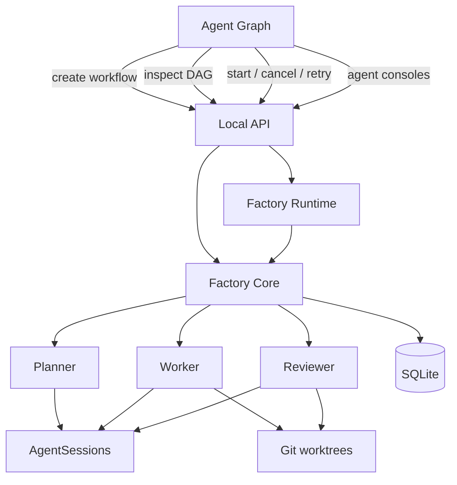

# Architecture

Agentic Software Factory is a local Rust application with a React dashboard. The API
binds to `127.0.0.1`. Durable execution state lives in SQLite, agent configuration in
TOML, and visual graph state in JSON. Each task runs in a Git worktree.



The dashboard requests semantic Factory operations. It does not execute arbitrary
shell commands.

## Workspace structure

```text
crates/
  factory-types     Run, Task, TaskAttempt, evidence, review, and session types
  factory-agent     Configured subprocess execution, output capture, cancellation
  factory-db        SQLite persistence and versioned migrations
  factory-git       Repository checks, worktrees, and Git evidence
  factory-core      Planning, invariants, task transitions, and execution policy
  factory-runtime   In-process background workflow ownership
  factory-api       Explicit local HTTP operations and session streams
  factory-cli       Bootstrap/runtime CLI: init, start, status, dev
apps/
  dashboard         React, TypeScript, and @xyflow/react
```

Dependencies point toward `factory-types`. The CLI and API use Factory Core; the API
also owns one `factory-runtime` instance for background operations.

## Workflow lifecycle

A new workflow is persisted as `planning` before the Planner starts. Planning is a real
`AgentSession`; successful structured output is validated and persisted atomically as
tasks and dependencies. The workflow then becomes `planned`, and repository work does
not begin until **Start** is selected.

```text
planning → planned → active → completed
                    │       ├→ failed
                    │       └→ blocked
                    └────────→ cancelled
```

Start validates the configured Worker and Reviewer, the Git repository, the task DAG,
and the presence of planned tasks. The first runtime is sequential:

```text
lowest-position ready task
  → create or reuse its worktree
  → Worker AgentSession
  → capture Git and agent-reported evidence
  → Reviewer AgentSession
  → approve, retry, or fail
  → select the next ready task
```

The Worker and Reviewer come only from `.factory/config.toml`. The Reviewer receives
the task objective, acceptance criteria, diff evidence, and Worker output. Its JSON
decision must be `approve` or `request_changes`. Change requests and Worker failures
are limited to three total `TaskAttempt` records per task.

Cancellation sets a run-scoped signal, stops scheduling, terminates the current
configured agent process tree, and preserves the worktree and recorded evidence. A
Factory restart marks formerly running sessions and attempts as `interrupted`, running
tasks as `failed`, and active/planning workflows as `failed`; the graph can then expose
the failure and eligible retry.

## Persistence and concurrency

SQLite tables include `runs`, `tasks`, `task_dependencies`, `task_attempts`, and
`agent_sessions`. `TaskAttempt` stores the attempt number, agent, status, timestamps,
worktree, commit, exit code, error, evidence, and structured review.

SQLite uses WAL mode and a bounded busy timeout. API handlers hold their shared
connection only for short reads or writes. Runtime jobs open separate Factory/database
connections, so no API mutex is held while an external agent runs. Session output is
appended with short writes and bounded to the latest 1 MB per stream.

The Rust process owns background planning and execution. Browser reloads do not stop a
workflow. This is an in-process runtime; it does not use an external queue or continue
subprocesses across a Factory process restart.

## API boundary

| Method | Route                         | Purpose                                      |
| ------ | ----------------------------- | -------------------------------------------- |
| POST   | `/api/runs`                   | Persist and begin planning a workflow        |
| GET    | `/api/runs/:id`               | Read tasks, attempts, and sessions           |
| POST   | `/api/runs/:id/start`         | Validate and schedule a planned workflow     |
| POST   | `/api/runs/:id/cancel`        | Cancel that run's live operation             |
| POST   | `/api/tasks/:id/retry`        | Retry an eligible task within the limit      |
| GET    | `/api/graph`                  | Read Factory entities and semantic links     |
| GET    | `/api/sessions/:id/stream`    | Stream one known session through SSE         |
| GET    | `/api/graph/workspace`        | Read visual workspace state                  |
| PUT    | `/api/graph/workspace`        | Validate and atomically save visual state    |
| GET    | `/api/config`                 | Read configured agents and role assignments  |
| PUT    | `/api/config`                 | Validate and atomically save configuration   |

Agent output uses session-scoped Server-Sent Events because current configured
invocations are non-interactive. The stream reads only a known persisted session and
closes at a terminal state. No stdin or WebSocket route is present.

## Agent Graph state ownership

The graph merges state without changing its owner:

- `/api/graph` supplies agents, roles, workflows, tasks, assignments, active execution
  links, containment, and dependencies.
- `.factory/graph.json` stores manual positions, groups, notes, memberships, and custom
  agent-to-agent links.
- `.factory/config.toml` stores real agents and role assignments.
- SQLite stores workflows, task DAGs, attempts, evidence, and sessions.

Role assignments are editable configuration semantics. Workflow containment and task
dependencies are read-only in this release. Groups, notes, memberships, and custom
agent links are visual topology only and never trigger execution.

## CLI

The public CLI is limited to `factory init`, `factory start`, and read-only
`factory status`, plus `--help` and `--version`. Debugging commands remain under
`factory dev`. Normal workflow creation and operation happen in Agent Graph.

Release builds embed the compiled dashboard with `rust-embed`; development builds read
`apps/dashboard/dist`. See [Development](development.md) and [Security](security.md).
