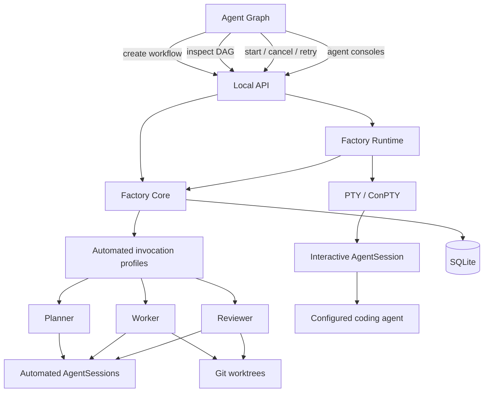

# Architecture

Agentic Software Factory is a local Rust application with a React dashboard. The API
binds to `127.0.0.1`. Durable execution state lives in SQLite, agent configuration in
TOML, and visual graph state in JSON. Each task runs in a Git worktree.



The dashboard requests semantic Factory operations. It does not execute arbitrary
shell commands.

## Workspace structure

```text
crates/
  factory-types     Run, Task, TaskAttempt, evidence, review, and session types
  factory-agent     Configured subprocess execution, output capture, cancellation
  factory-db        SQLite persistence and versioned migrations
  factory-git       Repository checks, worktrees, and Git evidence
  factory-core      Planning, invariants, task transitions, and execution policy
  factory-runtime   In-process background workflow ownership
  factory-api       Explicit local HTTP operations and session streams
  factory-cli       Bootstrap/runtime CLI: init, start, status, dev
apps/
  dashboard         React, TypeScript, and @xyflow/react
```

Dependencies point toward `factory-types`. The CLI and API use Factory Core; the API
also owns one `factory-runtime` instance for background operations.

## Workflow lifecycle

A new workflow is persisted as `planning` before the Planner starts. Planning is a real
`AgentSession`; successful structured output is validated and persisted atomically as
tasks and dependencies. The workflow then becomes `planned`, and repository work does
not begin until **Start** is selected.

```text
planning → planned → active → completed
                    │       ├→ failed
                    │       └→ blocked
                    └────────→ cancelled
```

Start validates the workflow team (planner, workers, reviewers, and any additional
roles), the Git repository, the task DAG, and the presence of planned tasks. The first
runtime is sequential:

```text
lowest-position ready task
  → create or reuse its worktree
  → Worker AgentSession (role = task role or worker)
  → capture Git and agent-reported evidence
  → Reviewer AgentSession
  → approve, retry, or fail
  → select the next ready task
```

Teams come only from `.factory/config.toml` role assignments. Every workflow stores a
team snapshot: which planner, workers, reviewers, and additional roles participate.
Global assignments answer which agents *may* act as Worker; the team decides which
ones *do* for that workflow. Tasks may name a role (assigned by the Planner from the
team's role catalog); a task without a role defaults to Worker. See [Roles](roles.md)
for the full model.

The Reviewer receives
the task objective, acceptance criteria, diff evidence, and Worker output. Its JSON
decision must be `approve` or `request_changes`. Change requests and Worker failures
are limited to three total `TaskAttempt` records per task. Within a team of several
workers, execution attempts route round-robin; review attempts rotate across the
selected reviewers. Selection is a deterministic function of persisted state and
survives restarts.

Cancellation sets a run-scoped signal, stops scheduling, terminates the current
configured agent process tree, and preserves the worktree and recorded evidence. A
Factory restart marks formerly running sessions and attempts as `interrupted`, running
tasks as `failed`, and active/planning workflows as `failed`; the graph can then expose
the failure and eligible retry.

## Role model

Role definitions are independent from agents. Core roles (Planner, Worker, Reviewer,
Architect, Researcher, Test Engineer, Security Auditor, Documentation Writer) are
built in; custom roles are `[roles.<slug>]` tables in `.factory/config.toml`. A role
definition says what the role does; a `[[role_assignments]]` entry permits one agent
to perform it. One role may have several agents, one agent may hold several roles,
and at most one assignment per role is preferred.

```text
RoleDefinition
      │
      ├── Core (built-in ids)
      └── Custom ([roles.<slug>] in config.toml)
             │
             ▼
      RoleAssignments  ── many-to-many ──  Agents
             │
             ▼
         Workflow team snapshot (runs.team)
             │
             ▼
           Tasks (tasks.role, default worker)
```

Runtime resolution for one execution attempt:

```text
task role → workflow team assignment set → routing policy → selected agent
→ AgentSession(role = actual role id) → TaskAttempt(role, agent)
```

Routing is deterministic: the preferred assignment is the default team selection,
execution attempts cycle the selected worker pool by persisted attempt count, and
review attempts rotate by attempt number. There is no heuristic or model-based
routing. Execution stays sequential; the pool topology is parallel-ready.

## Persistence and concurrency

SQLite tables include `runs`, `tasks`, `task_dependencies`, `task_attempts`, and
`agent_sessions`. `TaskAttempt` stores the attempt number, agent, role, status,
timestamps, worktree, commit, exit code, error, evidence, and structured review.
`runs.team` stores each workflow's team snapshot, `tasks.role` and
`task_attempts.role` preserve the role that actually executed, and
`agent_sessions.role` records the same per session.

SQLite uses WAL mode and a bounded busy timeout. API handlers hold their shared
connection only for short reads or writes. Runtime jobs open separate Factory/database
connections, so no API mutex is held while an external agent runs. Session output is
appended with short writes and bounded to the latest 1 MB per stream.

The Rust process owns background planning and execution. Browser reloads do not stop a
workflow. This is an in-process runtime; it does not use an external queue or continue
subprocesses across a Factory process restart.

## Agent invocation modes

Factory keeps automated work and user-driven terminals separate:

```text
Planner / Worker / Reviewer -> non-interactive process -> stdout / stderr -> exit
Agent Console               -> PTY or ConPTY         <-> terminal WebSocket
```

An agent profile defines its executable, workflow arguments, prompt transport, and
interactive arguments. Known profiles use argument transport (`codex exec`, `claude
-p`, `opencode run`, `gemini -p`, and `qwen -p`). Legacy known configurations are
inferred without rewriting their TOML; unknown legacy configurations remain custom
stdin agents. Custom argument transport replaces one complete `{mission}` argument or
appends the mission as one argument. No shell interpolation is used.

`AgentSession.mode` distinguishes `automated` workflow invocations from `interactive`
console invocations. Automated output remains split into stdout and stderr and streams
through SSE. Interactive output is the PTY's combined terminal byte stream and uses a
session-scoped WebSocket for input, output, and resize. Windows uses ConPTY; Linux and
macOS use the platform PTY through `portable-pty`.

## API boundary

| Method | Route                         | Purpose                                      |
| ------ | ----------------------------- | -------------------------------------------- |
| POST   | `/api/runs`                   | Persist and begin planning a workflow (optional team) |
| GET    | `/api/runs/:id`               | Read tasks, attempts, and sessions           |
| POST   | `/api/runs/:id/start`         | Validate and schedule a planned workflow; returns its team |
| POST   | `/api/runs/:id/cancel`        | Cancel that run's live operation             |
| PUT    | `/api/runs/:id/team`          | Replace the team before the workflow starts  |
| POST   | `/api/tasks/:id/retry`        | Retry an eligible task within the limit      |
| GET    | `/api/roles`                  | Read role definitions and assignments        |
| POST   | `/api/roles`                  | Create a custom role definition              |
| PUT    | `/api/roles/:id`              | Update a custom role definition              |
| DELETE | `/api/roles/:id`              | Delete an unused custom role                 |
| POST   | `/api/roles/:id/assignments`  | Assign an agent to a role                    |
| DELETE | `/api/roles/:id/assignments/:agent` | Remove one role assignment            |
| PUT    | `/api/roles/:id/preferred`    | Mark one assignment as preferred             |
| GET    | `/api/graph`                  | Read Factory entities and semantic links     |
| GET    | `/api/sessions/:id/stream`    | Stream one known session through SSE         |
| POST   | `/api/agents/:agent/sessions` | Start that configured agent in a PTY          |
| DELETE | `/api/sessions/:id`           | Stop one live interactive session             |
| GET    | `/api/sessions/:id/terminal`  | Upgrade one live interactive session to WS    |
| GET    | `/api/graph/workspace`        | Read visual workspace state                  |
| PUT    | `/api/graph/workspace`        | Validate and atomically save visual state    |
| GET    | `/api/config`                 | Read agents, custom role definitions, and role assignments |
| PUT    | `/api/config`                 | Validate and atomically save configuration   |

Automated output uses session-scoped Server-Sent Events. Interactive terminal traffic
uses WebSocket only after the session ID resolves to a live Factory-owned PTY session.
Both transports close at a terminal state.

## Agent Graph state ownership

The graph merges state without changing its owner:

- `/api/graph` supplies agents, roles, workflows, tasks, assignments, active execution
  links, containment, and dependencies.
- `.factory/graph.json` stores manual positions, groups, notes, memberships, and custom
  agent-to-agent links.
- `.factory/config.toml` stores real agents and role assignments.
- SQLite stores workflows, task DAGs, attempts, evidence, and sessions.

Role assignments are editable configuration semantics. Workflow containment and task
dependencies are read-only in this release. Groups, notes, memberships, and custom
agent links are visual topology only and never trigger execution.

## CLI

The public CLI is limited to `factory init`, `factory start`, and read-only
`factory status`, plus `--help` and `--version`. Debugging commands remain under
`factory dev`. Normal workflow creation and operation happen in Agent Graph.

Release builds embed the compiled dashboard with `rust-embed`; development builds read
`apps/dashboard/dist`. See [Development](development.md) and [Security](security.md).
