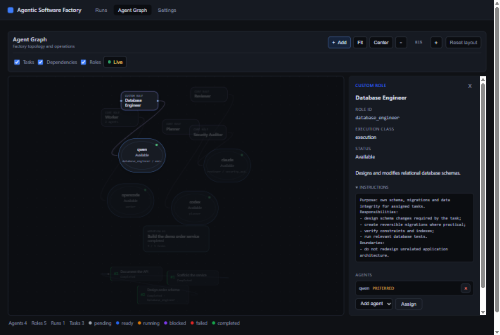

# Roles

This document explains the Factory role system: what roles are, how they differ from
agents, which roles are built in, how multiple agents share a role, how workflows pick
a team, and how to write good custom roles.



## What a role is

A **role** describes a responsibility inside the Factory: what this participant is
supposed to do, what it should avoid, and what output it must produce. Roles are
definitions, not executables. When Factory runs a role, it sends a mission built from
the role definition to one of the agents assigned to that role.

## Roles vs agents

Three concepts, deliberately separate:

```text
Agent      = an executable coding CLI you install and authenticate (Codex,
             Claude Code, OpenCode, Gemini CLI, Qwen, or a custom command)
Role       = a responsibility inside Factory (Planner, Worker, Reviewer, or a
             custom role you define)
Assignment = configuration that permits one agent to perform one role
```

An agent can hold several roles:

```text
Agent: Claude
  Roles: Reviewer, Security Auditor, Documentation Writer
```

A role can be filled by several agents:

```text
Role: Worker
  Agents: OpenCode, Codex, Qwen
```

Factory never duplicates an agent definition to fill multiple roles, and never invents
`worker_2`-style names to distinguish multiple holders of the same role. Each
assignment is an independent configuration entry; at most one assignment per role is
marked `preferred`.

The agent keeps owning its own model, authentication, and capabilities. Factory only
changes the mission text according to the selected role. If the underlying CLI cannot
do something (for example unrestricted web research), giving it a role does not add
that capability — Factory orchestrates agents, it does not invent capabilities.

## Core roles

Core roles are built-in role definitions with stable ids. They ship with Factory and
cannot be redefined or deleted. You assign agents to them; you can stop using the
optional ones by removing their assignments.

| Id                     | Name                 | Execution class | Purpose                                                        |
| ---------------------- | -------------------- | --------------- | -------------------------------------------------------------- |
| `planner`              | Planner              | planning        | Turns the workflow objective into a valid task DAG             |
| `worker`               | Worker               | execution       | Implements a planned task in an isolated worktree              |
| `reviewer`             | Reviewer             | review          | Independently evaluates task output against the criteria       |
| `architect`            | Architect            | advisory        | Analyzes architecture and technical boundaries                 |
| `researcher`           | Researcher           | advisory        | Gathers technical context another role needs                   |
| `test_engineer`        | Test Engineer        | execution       | Designs and runs verification for task requirements            |
| `security_auditor`     | Security Auditor     | review          | Reviews security-sensitive boundaries of a change              |
| `documentation_writer` | Documentation Writer | post_process    | Produces or updates documentation after implementation          |

`planner`, `worker`, and `reviewer` are **pipeline roles**: every workflow needs them,
and a fresh Factory configuration assigns all three. The other five are **optional
core roles**: they participate only when a workflow explicitly composes them into its
team. Core roles are reusable definitions, not mandatory pipeline stages — configuring
a Security Auditor does not add a review step to anything until a workflow selects it.

## Multiple agents per role

Assignments are many-to-many. A typical setup:

```text
Planner
  Codex (preferred)

Worker
  OpenCode (preferred)
  Codex
  Qwen

Reviewer
  Claude (preferred)
  Codex

Security Auditor
  Claude
```

The `preferred` flag marks the default selection. When you create a workflow without
picking a team, Factory uses each pipeline role's preferred assignment (or the first
declared assignment when nothing is marked).

Within a workflow's selected team, task execution routes deterministically:

- **Planner**: exactly one per workflow. If several planners are assigned globally,
  the workflow still selects one; Factory does not run planner ensembles or merge
  plans.
- **Workers**: round-robin across the selected worker pool, ordered by the number of
  execution attempts already recorded for that workflow. The first task goes to the
  first selected worker, the next attempt to the next one, and so on, wrapping
  around. Retries rotate to the next worker.
- **Reviewers**: one reviewer per attempt, rotating by attempt number. Each review of
  the same task goes to the next selected reviewer.

Selection is a fixed, restart-safe function of persisted state (the attempt count in
SQLite). There is no AI-based routing, cost optimization, or load prediction. See
[Runtime behavior](#runtime-behavior) for the exact resolution chain.

## Workflow role selection

Global assignments answer: *which agents may act as Worker?* A workflow answers:
*which Worker instances participate here?* Factory does not attach every configured
worker to every workflow.

When you create a workflow you can compose its team:

```text
New Workflow

Objective
...

Team
Planner     Codex
Workers     OpenCode, Codex
Reviewers   Claude

[ Advanced team ]      ← collapsed by default
Security Auditor       Claude
Database Engineer      OpenCode
```

Defaults keep simple workflows simple: each pipeline role uses its preferred agent.
Advanced roles are optional and only execute when the Planner assigns them tasks. A
team can be edited from the Workflow Inspector until the workflow starts; once
active, the team is locked. The team is stored as a snapshot on the workflow, so
changing global configuration later never rewrites what a running or historical
workflow used.

## Custom roles

You can create arbitrary role definitions from Agent Graph (`+` → Role → Custom role)
or by editing `.factory/config.toml`. Custom roles are project-local definitions with:

| Field            | Meaning                                                        |
| ---------------- | -------------------------------------------------------------- |
| `id` (slug)      | Stable identifier used by plans, tasks, and sessions           |
| `name`           | Display name                                                   |
| `description`    | One-line summary shown to the Planner and in inspectors        |
| `execution_class`| Where Factory may use the role (see below)                     |
| `instructions`   | Reusable instruction text sent to the agent in its mission     |

Custom roles do not own model settings. Temperature, model choice, provider, and
token limits belong to the agent CLI, not to Factory.

The slug is derived from the name (`Database Engineer` → `database_engineer`) and is
editable until first save. After a role has been used by persisted workflows, keep
its id stable: renaming the display name is safe; changing the slug orphans historical
references. Deleting a custom role used by an active workflow is rejected.

### Execution classes

Every role has one execution class. The class determines **where Factory may use the
role**; the instructions determine **what it does**.

| Class         | Meaning in Factory                                            |
| ------------- | -------------------------------------------------------------- |
| `planning`    | Produces the plan for a workflow                              |
| `execution`   | Implements tasks                                              |
| `review`      | Evaluates output against criteria                             |
| `advisory`    | Produces context or analysis for other roles                  |
| `post_process`| Follows implementation, for example documentation             |

Core role mapping: Planner → planning, Worker → execution, Reviewer → review,
Architect → advisory, Researcher → advisory, Test Engineer → execution,
Security Auditor → review, Documentation Writer → post_process.

In the current runtime every task role executes through the same
implement → evidence → review pipeline regardless of class; the class mainly guides
the Planner's catalog, the graph, and the team UI. Custom review roles that replace
the post-task Reviewer are not supported yet — the Reviewer role always performs
post-task review.

## Writing good role instructions

A good role answers four questions:

1. What is this role responsible for?
2. What is explicitly outside its responsibility?
3. What inputs should it consider?
4. What output/evidence should it produce?

Structure instructions around:

```text
Responsibility  what the role owns
Scope           what it works on
Constraints     what it must not do
Expected output what evidence or artifacts it produces
```

Instructions are added to the mission under the role section, next to Factory's own
constraints. Factory's execution constraints (worktree isolation, not modifying
`.factory` state) always take precedence and cannot be overridden by role text.

## Role design patterns

Good granularity maps to a meaningful ownership or review responsibility:

```text
Frontend Engineer
Backend Engineer
Database Engineer
Migration Specialist
Performance Analyst
Accessibility Reviewer
API Designer
Release Engineer
Localization Reviewer
```

Prefer a focused role over a technology mega-role. A role should be selectable for a
class of tasks and reviewable as a unit.

## Bad role designs

**Too vague:**

```text
Super Developer
Do everything perfectly.
```

Why it fails: no scope, overlaps every other role, no output contract, and the
scheduler cannot use it meaningfully — the Planner has no way to decide when to
select it.

**Technology kitchen sink:**

```text
React Next TypeScript CSS Tailwind Supabase API Database Engineer
```

Why it fails: an overly specific mega-role is worse than two focused roles. It
becomes unreviewable, and the description duplicates what the task objective should
already state.

**No boundaries:**

```text
Fixer
Solve anything.
```

Why it fails: without boundaries the role competes with Worker, and its output cannot
be evaluated against a contract.

**Too narrow:**

```text
Button Border Radius Specialist
```

Why it fails: task granularity, not role granularity. Put this in a task objective,
not a role.

## Examples

### Database Engineer

```text
Class: implementation (execution)

Description:
Owns relational schema, migrations, query correctness and data integrity.

Responsibilities:
- design schema changes required by the task;
- preserve existing data where required;
- create reversible migrations where practical;
- verify constraints and indexes;
- run relevant database tests.

Boundaries:
- do not redesign unrelated application architecture;
- do not modify frontend behavior unless the task requires it.

Expected output:
- implementation;
- migration files;
- verification evidence;
- concise note about compatibility risks.
```

### Security Auditor (review class)

```text
Description:
Reviews security-sensitive boundaries and implementation decisions.

Responsibilities:
- authentication and authorization;
- validation of untrusted input;
- secret exposure;
- unsafe process/file/network boundaries;
- dependency risks directly relevant to the change.

Expected output:
- findings with severity;
- concrete evidence;
- approve or request changes where applicable.
```

Avoid vague instructions like "find every vulnerability" — they produce noise instead
of findings.

### Researcher (advisory class)

```text
Description:
Collects technical context required before implementation.

Responsibilities:
- inspect repository context;
- compare relevant existing approaches;
- identify constraints and unknowns;
- return concise evidence-backed findings.

Boundary:
does not modify production code unless explicitly assigned an implementation task.
```

## Configuration format

Roles live in `.factory/config.toml`. Custom role definitions are `[roles.<slug>]`
tables; assignments are `[[role_assignments]]` entries.

One core role with several assignments:

```toml
[agents.opencode]
kind = "open_code"
command = "opencode"
args = ["run"]

[agents.codex]
kind = "codex"
command = "codex"
args = ["exec"]

[agents.claude]
kind = "claude_code"
command = "claude"
args = ["-p"]

[[role_assignments]]
role = "worker"
agent = "opencode"
preferred = true

[[role_assignments]]
role = "worker"
agent = "codex"

[[role_assignments]]
role = "reviewer"
agent = "claude"
preferred = true
```

A custom role with one preferred agent:

```toml
[roles.database_engineer]
name = "Database Engineer"
description = "Designs and modifies relational database schemas."
execution_class = "execution"
instructions = """
Purpose: own schema, migrations and data integrity for assigned tasks.
Responsibilities:
- design schema changes required by the task;
- create reversible migrations where practical;
- verify constraints and indexes;
- run relevant database tests.
Boundaries:
- do not redesign unrelated application architecture.
"""

[[role_assignments]]
role = "database_engineer"
agent = "codex"
preferred = true
```

The same agent may appear in several roles; an agent may not appear twice in the same
role; at most one assignment per role may be `preferred`. Assignment entries
referencing unknown roles or agents are rejected on save.

### Legacy configuration

Older projects configured one agent per role:

```toml
[roles.planner]
agent = "codex"

[roles.worker]
agent = "opencode"

[roles.reviewer]
agent = "claude"
```

This form still loads. On the first start after upgrading, Factory rewrites it as
`[[role_assignments]]` entries (each migrated assignment becomes preferred), keeps the
original file as `config.toml.bak`, and writes the new file atomically. No
`factory init` or `.factory` deletion is required.

## Agent Graph workflow

- Each visible role is one node. A role with three agents is still one node with
  three assignment edges — never three `worker_2`-style nodes.
- Every assignment is its own edge (`role → agent`), so two agents holding the same
  role never collapse into one ambiguous link.
- Pipeline roles are always visible; optional core roles appear once they have an
  assignment; custom roles are always visible.
- Selecting a role opens the Role Inspector: description, instructions, assigned
  agents, preferred marker, add/remove agent, and edit/duplicate/delete for custom
  roles. Core roles allow assignment editing but cannot be redefined or deleted.
- Dragging a connection from a role to an agent adds an assignment; deleting the
  edge removes it. Both edit the same configuration as the Role Inspector and
  Settings — there is no UI-only relationship.
- The "+" menu creates workflows, agents, roles, groups, and notes. Role creation
  offers core roles worth enabling and the custom role editor.
- A compact Roles filter hides role nodes and their assignment edges when the graph
  gets dense.

## Runtime behavior

Planning:

```text
workflow objective
+ AVAILABLE ROLES catalog (task-capable roles in the workflow's team)
→ Planner produces a task DAG
→ tasks may carry an optional role id
→ role must be enabled for the workflow, otherwise the plan is rejected and repaired
```

A task without a role defaults to Worker. Unknown roles are never silently mapped to
Worker — a plan that references a role the workflow did not select is rejected, and
the Planner is asked to correct it (up to the usual three attempts).

Task execution resolves deterministically:

```text
task.role (or worker)
→ workflow team assignment set for that role
→ routing policy (preferred default; round-robin within the team)
→ selected agent
→ AgentSession(role = actual role id, agent)
→ TaskAttempt(role, agent)
```

Every workflow preserves its team snapshot, so later changes to global assignments
never rewrite history: sessions and attempts keep the role id that actually ran (for
example `database_engineer`, not `worker`), and completed workflows stay auditable.

Execution remains sequential. Multiple selected workers widen the pool the router
chooses from; they do not run tasks in parallel. The design is parallel-ready, but no
concurrent scheduling is performed in this release.

Start refuses a workflow whose team is incomplete or no longer valid — for example
when a task requires a role whose agent assignment was removed — with a diagnostic
naming the role and agent. Agent availability (executable resolution) is checked
before any task starts, preserving the existing fail-fast behavior.

## Troubleshooting

**"No agent is assigned to the X role. Configure one from the dashboard."**
The role has no assignments. Add one from the Role Inspector, Settings, or by
dragging a role→agent connection in Agent Graph.

**"agent 'x' is not assigned to the 'worker' role"** (at workflow creation or team
editing)
The team references an agent that is not assigned to that role. Assign the agent
first, or pick another one.

**"task N requires role 'x' which has no agents in this workflow's team"** (at Start)
The plan contains a task with a role that the workflow's team does not cover. Edit
the team to include an agent for that role, or re-plan the workflow.

**A plan was rejected with "role 'x' which is not enabled for this workflow"**
The Planner invented a role outside the team. Add the role to the workflow's advanced
team, or make the task a regular Worker task.

**"role 'x' is used by an active workflow and cannot be deleted"**
Delete or finish the workflow first. Historical workflows keep working because they
hold team snapshots.

**The config was rewritten and a `config.toml.bak` appeared**
That is the one-time legacy migration described above. The `.bak` file is your
previous config; the new `config.toml` is equivalent.

**Missions do not contain my custom instructions**
Check that the agent is actually assigned to the custom role and that the workflow's
team includes the role. Instructions are sent only when the role executes.
